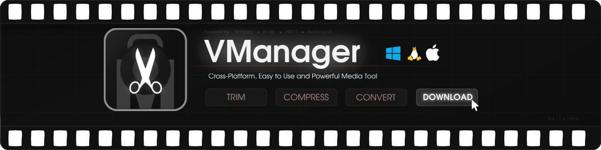

# VManager - FFmpeg & yt-dlp GUI
VManager es una aplicación open-source multiplataforma para recortar, comprimir, convertir y descargar videos o audios de forma rápida y eficiente. Desarrollado en C# con Avalonia UI. Disponible para Windows, Linux y macOS, sin dependencias externas.

<div align="center">



[](#instalación "Installation")
[](https://ko-fi.com/baltafranz "Donate")
[](LICENSE.md "License")
[](https://github.com/balta-dev/VManager/actions "CI Status")
[](https://github.com/balta-dev/VManager/commits "Commit History")
[](https://github.com/balta-dev/VManager/pulse?period=monthly "Last activity")

</div>

* [INSTALACIÓN](#instalación)
    * [Actualizar](#actualizar)
    * [Dependencias](#dependencias)
    * [Compilar](#compilar)
      * [Pre-requisitos](#pre-requisitos)
      * [Clonar el repo](#clonar-el-repo)
    
* [CONTRIBUIR](CONTRIBUTING.md#contribuir-a-vmanager)
  * [Abrir un Issue](CONTRIBUTING.md#abrir-un-issue)
  * [Instrucciones para Desarrolladores](CONTRIBUTING.md#instrucciones-para-desarrolladores)
    
* [EXTRA](#extra)
  * [Motivaciones](#motivaciones)
  * [Objetivos](#objetivos)
  * [Agradecimientos](#agradecimientos)
    


# INSTALACIÓN
[](https://github.com/balta-dev/VManager/releases/latest/download/VManager-win-x64-self-contained.zip)
[](https://github.com/balta-dev/VManager/releases/latest/download/VManager-linux-x64.tar.gz)
[](https://github.com/balta-dev/VManager/releases/latest/download/VManager-osx-x64.tar.gz)
[](https://github.com/balta-dev/VManager/releases)

Puedes instalar VManager haciendo click en la insignia correspondiente a tu sistema operativo o desde [Releases](https://github.com/balta-dev/VManager/releases). 

### Windows

1. Extrae el contenido
2. Ejecuta `VManager.exe`
3. ¡Listo para usar!

> **Nota**: Si te falta .NET Framework, descarga la versión "self-contained".

---

### Linux 

1. Extrae el contenido:

   ```bash
   tar -xzf VManager-linux-x64.tar.gz
   ```

2. Ejecuta la aplicación:

   ```bash
   ./VManager
   ```

3. ¡Listo para usar!

---

### macOS

1. Extrae el contenido
2. Ejecuta la aplicación

> **Nota**: Todavía no ha sido testeado en esta plataforma.


## ACTUALIZAR
VManager tiene implementado un sistema de actualizaciones automáticas cada vez que abres la aplicación, por lo que no deberías preocuparte.

Si lo deseas, podes actualizar VManager manualmente ejecutando `Updater`. 

Al ejecutar  ` VManager` cada binario embebido se extrae en la carpeta temporal en caso de no disponerlo (se utiliza el binario del sistema cuando sea posible), verifica que no esté corrupto e intenta actualizarlo (excepto `ffmpeg` y `ffprobe`) automáticamente. Esto se hace para evitar incompatibilidades de librerías dinámicas en Linux, aunque es irrelevante para Windows o Mac.

## DEPENDENCIAS
No se necesita descargar nada de antemano, pero es recomendable tener la última versión actualizada de FFmpeg en Windows/Mac. En el caso de Linux, FFmpeg ya viene preinstalado y se actualiza automáticamente cuando actualizas el sistema.

### Windows 

 #### Opción 1 : Powershell (RECOMENDADA)

1. Abre `Powershell` .
2. Escribe el comando:

   ```powershell
   winget install "FFmpeg (Essentials Build)"
   ```

3. ¡Todo listo!

> **Nota**: Para mantenerlo actualizado, ejecuta periódicamente `winget upgrade --all`.

#### Opción 2 : Descarga manual

1. Descarga y descomprime [ffmpeg-release-essentials.7z](https://www.gyan.dev/ffmpeg/builds/ffmpeg-release-essentials.7z)
3. Copia `ffmpeg.exe` y `ffprobe.exe` que están dentro de la carpeta `bin`, esos binarios debes pegarlos en cualquier ruta del [PATH](#PATH) en Windows, ya que VManager intentará encontrarlos allí. Elige únicamente una sola ruta.
4. ¡Todo listo!

> **Nota**: Para mantenerlo actualizado tendrás que repetir todos los pasos nuevamente, de manera periódica.

#### PATH

La lista de ubicaciones por defecto que están en PATH son: 

   ```text
   C:\Windows\System32\
   C:\Windows\
   ```

> **Recomendación:** Agregar una nueva entrada al PATH, como `C:\Program Files\ffmpeg\bin`. 

 ### Mac

1. Ejecutar el siguiente comando para descargar `homebrew` si no lo tienes instalado.
   ```bash
   /bin/bash -c "$(curl -fsSL https://raw.githubusercontent.com/Homebrew/install/HEAD/install.sh)"   
   ```

2. Instala FFmpeg:
   ```bash
   brew install ffmpeg
   ```

3. ¡Todo listo!

> **Nota:** Para mantenerlo actualizado, ejecuta periódicamente `brew upgrade ffmpeg`.

## COMPILAR

### Pre-requisitos

### 	1) .NET 9 SDK

​	Descargalo desde [https://dotnet.microsoft.com/download/dotnet/9.0](https://dotnet.microsoft.com/download/dotnet/9.0)
​	Verificá la instalación con: `dotnet --version` Debe mostrar `9.x.x`.

### 	2) Git

​	Descargalo desde https://git-scm.com/downloads
​	Verificá con: ` git --version `

### 	3) Git LFS *(Large File Storage)*

​	El repositorio contiene binarios pesados embebidos (FFmpeg, yt-dlp, Deno) que se almacenan con Git LFS. **Sin esto, los binarios se clonarán 	como punteros vacíos y la app no funcionará.**

​	**Windows:** `winget install GitHub.GitLFS` O descargalo desde https://git-lfs.com

​	**Linux (Debian/Ubuntu/Arch):** `sudo [apt install/pacman -S] git-lfs`

​	**macOS:** `brew install git-lfs`

​	Luego ejecutá: `git lfs install`

### Clonar el repo

   ```bash
   git clone https://github.com/balta-dev/VManager.git
   cd VManager
   ```

> Si ya lo habías clonado **antes** de tener Git LFS instalado, ejecutá `git lfs pull` dentro del repositorio para descargar los binarios faltantes.

### Opción 1: Compilación estándar (requiere .NET 9 instalado en el sistema)

### Windows

   ```powershell
   dotnet publish VManager/VManager.csproj -c Release -r win-x64 --no-self-contained -o ./publish/win
   ```

### Linux
   ```bash
   dotnet publish VManager/VManager.csproj -c Release -r linux-x64 --no-self-contained -o ./publish/linux
   ```

### macOS

   ```bash
   dotnet publish VManager/VManager.csproj -c Release -r osx-x64 --no-self-contained -o ./publish/mac
   ```

> El ejecutable queda en la carpeta `publish/<plataforma>/`.
>  En Linux/macOS puede que necesites dar permisos: `chmod +x ./publish/linux/VManager`

### Opción 2: Compilación self-contained (todo incluido, sin necesitar .NET instalado)

Esta modalidad genera un ejecutable que **no requiere que el usuario tenga .NET 9** en su sistema. El binario es más grande pero portátil.

### Windows

   ```powershell
   dotnet publish VManager/VManager.csproj -c Release -r win-x64 --self-contained -o ./publish/win-sc
   ```

### Linux
   ```bash
   dotnet publish VManager/VManager.csproj -c Release -r linux-x64 --self-contained -o ./publish/linux-sc
   ```

### macOS

   ```bash
   dotnet publish VManager/VManager.csproj -c Release -r osx-x64 --self-contained -o ./publish/mac-sc
   ```

------

## Notas adicionales

- **macOS:** El proyecto todavía no fue testeado oficialmente en esa plataforma.

- **RID (Runtime Identifier):** Si tu máquina es ARM (como un Apple Silicon o Raspberry Pi), reemplazá `x64` por `arm64` en los comandos.

- **Restaurar paquetes:** Si la compilación falla buscando paquetes NuGet, ejecutá primero `dotnet restore` en la raíz del repositorio.

- Los binarios embebidos (FFmpeg, yt-dlp, Deno) se incluyen automáticamente en la publicación gracias a Git LFS... no hace falta instalarlos por separado.


# CONTRIBUIR
Vea [CONTRIBUTING.md](CONTRIBUTING.md#contribuir-a-vmanager) para conocer instrucciones para [abrir un issue](CONTRIBUTING.md#abrir-un-issue) y [contribuir código al proyecto](CONTRIBUTING.md#instrucciones-para-desarrolladores).

# EXTRA

Esta sección está enfocada en brindar información adicional sobre el proyecto.

### Motivaciones

Cuando uno revisa alternativas open-source y encuentra proyectos interesantes (o incluso la solución a un problema), uno no puede evitar preguntarse muchas veces qué fue lo que llevó a aquella persona a comenzar todo.

#### ¿Por qué existe VManager?

Utilizo OBS-Studio para grabar la pantalla, y uno de mis hobbies es jugar Ultrakill (específicamente, speedrunning). Utilizo Linux como mi daily driver, y como me molesta tener que abrir una aplicación de edición de videos únicamente para recortar clips decidí crear una herramienta que me solucione mi problema: [vcut](https://github.com/balta-dev/vcut). Es básica, escrita en Pascal en un rato, pero cumplía mis necesidades. Pronto me encontraría en la necesidad de compartir mis clips por Discord, pero frente a limitaciones de peso nació [vcompr](https://github.com/balta-dev/vcompr) también escrita en Pascal para comprimir vídeos. 

Esto me sirvía mucho en su momento, y no veía necesidad de complejizarlo. También me gustaba la idea de compartir algo simple que pudiera servirle a alguien que de casualidad se lo topara navegando en GitHub.

Pronto un amigo mío se interesaría, pero tuvo dificultades en entender el funcionamiento; no era lo suficientemente intuitivo. Me dio la idea de desarrollar una aplicación de escritorio que tuviera interfaz gráfica y sea fácil de entender a simple vista. Con eso, se me prendió la lamparita.

#### Obstáculos

La historia nunca puede ser de color de rosa, había un problema que tenía que solucionar primero: "¿Cómo hago eso? No tengo experiencia en interfaces gráficas". La verdad que estaba muy cómodo en escribir código interesante pero en la terminal, nunca había escrito una sola línea de C#. 

Investigué un poco, me encontré con el IDE Rider y ahí fue cuando descubrí Avalonia. Fue entonces cuando decidí lanzarme de lleno a mi primer framework, en un lenguaje que no conocía, y un tipo de desarrollo al que nunca estuve expuesto. Leí mucha documentación, decidí seguir el patrón de arquitectura MVVM, y así fue como le di a "Crear proyecto".

#### Inicios

Tuve muchas dudas, problemas de los que la Inteligencia Artificial no fue capaz de ayudar. Nuevas releases con funcionalidades rotas que antes funcionaban bien por haber cambiado código que a primera vista no parecía tener que ver. Comencé de a poco, una interfaz sencilla que te dejaba buscar el video, un campo para digitar "Porcentaje de Calidad" que en realidad no hacía nada, le dabas a "Comprimir" y ya está. 

Es importante mencionar que estaba muy contento en ese momento con tener algo que mínimamente haga lo que necesitaba, pero sabía que estaba muy por debajo todavía de lo que pude fácilmente desarrollar previamente en la terminal.

#### Experimentación

Antes inclusive de desarrollar la herramienta para recortar clips, ya estaba experimentando como "Modo Oscuro" y "Modo Claro", con sonidos, y un poco con el apartado estético del programa. Un par de días después de comenzar, ya tenía un "VCut" funcional con análisis de hardware. El progreso inicial que estaba haciendo era tan grande que sentía que podía llevarme el mundo conmigo y en menos de 1 semana ya tenía una base importante, 3 herramientas funcionales responsive, experimentando funcionalidades custom de drag and drop para Linux (no está actualmente soportado nativo por Avalonia).

#### Profundizando

Teniendo ya prácticamente "todo terminado", siempre encontraba una excusa para cambiar un botón, agregar una pantalla de bienvenida más linda, movimientos de controles más suaves, cambiar cosas de lugar. Fue ahí cuando empecé a enfocarme en QoL para el usuario final: 

* ¿Y si el usuario quiere operar con múltiples videos al mismo tiempo?
* Si el usuario cierra la app ahora mientras un proceso está de fondo, no lo cancela.
* Como usa colores de acento, puede pasar que tenga colores de acento (OS) que no se vean bien con el modo claro o el modo oscuro.
* Podría agregar hotkeys así el usuario no tiene que buscar manualmente la herramienta que necesita.
* Cuando tengo la opción para elegir códecs de video y audio, puedo tener combinaciones inestables o imposibles con el resultado de crashes o errores silenciosos de FFmpeg.

Y muchas otras cuestiones más de las que me fui dando cuenta más tarde, como tener en cuenta conversión de videos con múltiples pistas de audio, tener en cuenta que no todos saben español, un apartado de configuraciones para poder desactivar sonidos o notificaciones de VManager, que te avise cuando hay actualizaciones disponibles y actualizar con un botón.

#### Actualidad

Siento haber cumplido con muchísimas cosas que cuando comencé no imaginé. Al momento de rehacer el README, crear un CONTRIBUTING, se cumplen 5 meses desde que comencé. Estoy orgulloso del punto hasta el que ha llegado VManager, y todavía sigo con el mismo entusiasmo de hacerlo mejor cada día.

¿Que tengo hoy? Una aplicación en la que puedo confiar y no que simplemente funcione "por arte de magia". Un sistema de configuraciones completo, localización en 14 idiomas distintos, con imagen de perfil y colores personalizables para sentirlo más personal, optimizada para ocupar la menor cantidad de recursos posibles, guías completas de cómo utilizar cada herramienta, binarios extra para descargar videos o audios de internet con la posibilidad de descargarlos en paralelo, una implementación ingeniosa para D&D en Linux (con una ventana X11 invisible superpuesta), ¡y un montón de cosas más! 

### Objetivos

Si no lo dejé claro anteriormente, tengo la intención de que VManager sea lo más rápido, intuitivo y liviano posible. Que un usuario cualquiera, en búsqueda de una herramienta con características del estilo de VManager, encuentre lo que hice y realmente pueda satisfacer sus necesidades. Que no necesite depender de si tiene internet o no para recortar, convertir o comprimir videos/audios. Que no necesite estar sufriendo por excesivos anuncios de ciertas alternativas online o estar bloqueado bajo un paywall muchas veces ridículo.

Apoyo la moción de que toda funcionalidad básica de un usuario debe tener una contraparte gratuita, libre de distribución y modificación de código, y sobre todo tan potente y funcional como cualquier otra alternativa de paga.

Reconozco que todavía VManager puede no estar muy pulido o tener problemas claros, ya que se trata de un proyecto moderno y no dispongo de tanto tiempo disponible. Y por eso mismo tengo la intención de brindar lo mejor de mí con las herramientas que se me fueron brindadas para desarrollar este grandioso proyecto.

### Agradecimientos

Y bueno, no por ser lo último es lo menos importante. Es notable mencionar que no he estado solo en el desarrollo;  muchos compañeros de la facultad me han brindado su feedback en distintos setups, amigos míos me alentaron a continuarlo. Quiero agradecer específicamente a [@femaa33](https://www.youtube.com/@femaa33) por haber sido (y seguir siendo) el mayor tester de VManager, por haber sido quién me dio la idea de haber comenzado a desarrollar este proyecto en un primer lugar y además por haber diseñado la primera iteración del logo que fue inspiración para el logo actual. ¡Muchas gracias a todos por contribuir con su granito de arena!
